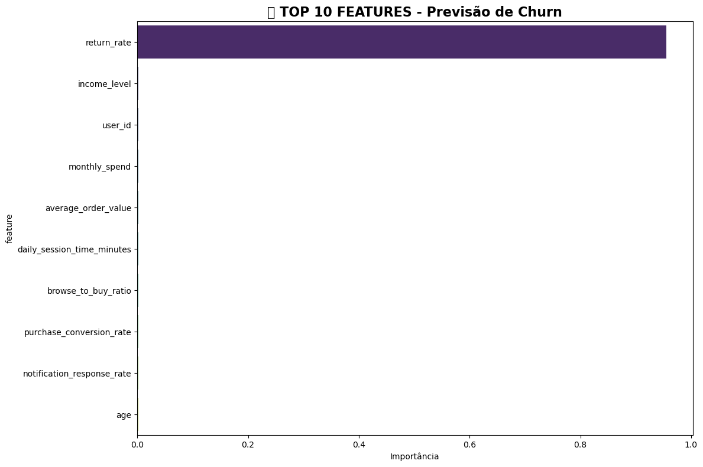
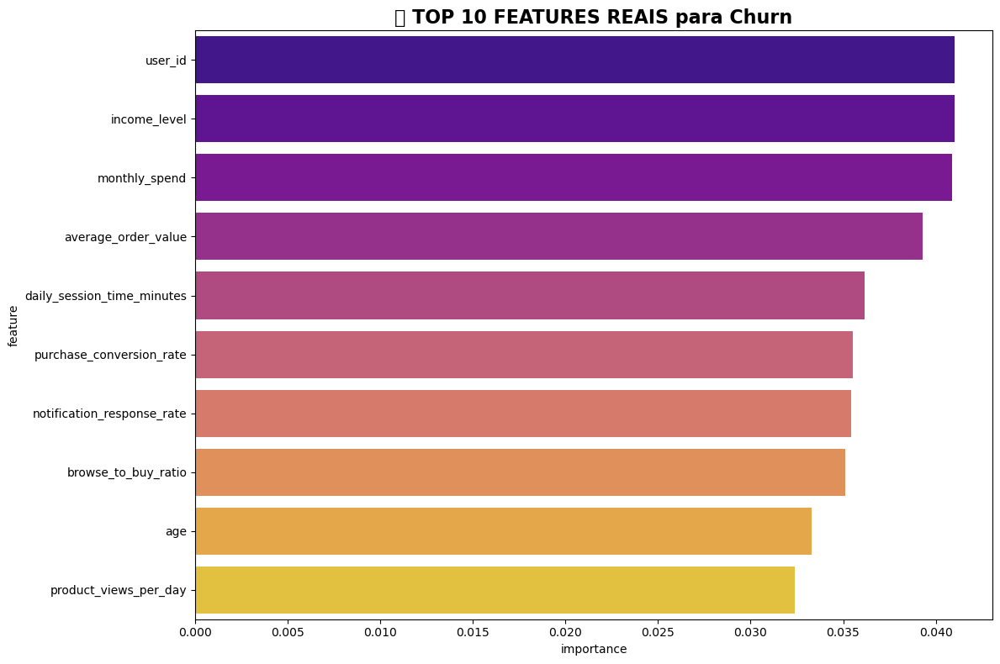

# E-commerce Customer Behavior Analysis / Análise de Comportamento de Clientes E-commerce

[English](#english) | [Português](#português)

---

## English

**End-to-end Data Science project analyzing 1M+ e-commerce customer records with ML pipeline.**

**Dataset:** Simulated e-commerce behavior (not stored due to GitHub limits - see `data/` folder). Contains demographic, behavioral, operational variables:
- "Weekly purchase frequency"
- "Cart abandonment rate" 
- "Return rate"
- "Subscription type (Premium vs Non-Premium)"
- "User segmentation indicators"

 

### 🎯 Business Problem
**Original:** Test Premium subscription impact on behavior/value  
**Extended:** + ML Churn prediction capabilities

### 📊 Key Results
| Model | ROC-AUC | Key Finding |
|-------|---------|-------------|
| **With Leakage** | **1.000** | `return_rate` 95.5% importance (data leakage!) |
| **Realistic** | **0.500** | Behavioral data **CANNOT predict churn proactively** |

**Critical Insight:** *"Need granular engagement tracking data for predictive ML"*

### 🔬 Methodology

1. EDA + Statistical tests (Mann-Whitney p=0.3779 ✓ Premium = No spending uplift)
2. Customer segmentation (income/spending)  
3. ML Pipeline: Churn prediction → Leakage detection → Realistic model

**Tech Stack:** pandas • NumPy • Matplotlib • SciPy • seaborn • scikit-learn • RandomForest

### 💎 Key Insights (Original + New)
✅ **No Premium vs Non-Premium differences** (purchases, returns, abandonment)  
✅ **Premium not a value differentiator**  
🔥 **NEW:** Current data insufficient for churn prediction

### 🏆 Business Recommendations
1. **Reactive retention:** Alert `return_rate > 75th percentile`
2. **A/B Testing:** Discounts for high-risk customers
3. **Data Strategy:** Track page time/clicks for future ML
4. **Reevaluate Premium value proposition**

---

## Português

**Projeto completo de Data Science: 1M+ registros e-commerce + pipeline ML.**

**Dataset:** Comportamento simulado (instruções em `data/`). Variáveis demográficas, comportamentais:
- "Frequência semanal de compras"
- "Taxa de abandono de carrinho"
- "Taxa de devolução" 
- "Tipo assinatura (Premium vs Não-Premium)"

### 🎯 Problema de Negócio
**Original:** Validar impacto Premium  
**Expandido:** + Predição de churn

### 📊 Resultados Principais
| Modelo | ROC-AUC | Descoberta |
|--------|---------|------------|
| **Vazamento** | **1.000** | `return_rate` 95.5% (detectado!) |
| **Realista** | **0.500** | **Dados NÃO predizem churn** |

**Insight Crítico:** *"Precisamos dados granulares de engajamento"*

### 🔬 Metodologia

1. EDA + Testes (Mann-Whitney p=0.3779 ✓ Premium sem uplift)
2. Segmentação renda/gasto
3. ML: Churn → Leakage detection → Modelo realista

**Tech:** pandas • NumPy • Matplotlib • SciPy • seaborn • scikit-learn • RandomForest

### 💎 Insights (Original + Novo)
✅ **Sem diferenças Premium vs Não-Premium**  
✅ **Premium não diferencia valor**  
🔥 **NOVO:** Dados insuficientes para churn

### 🏆 Recomendações
1. **Retenção reativa:** Alertas `return_rate > 75º`
2. **Teste A/B:** Descontos clientes risco
3. **Estratégia dados:** Rastrear tempo/cliques
4. **Reavaliar Premium**

---

## 🚀 Next Steps / Próximos Passos
- Time-series analysis / Análise temporal
- Advanced clustering / Clusterização avançada
- A/B experiments / Experimentos controlados

