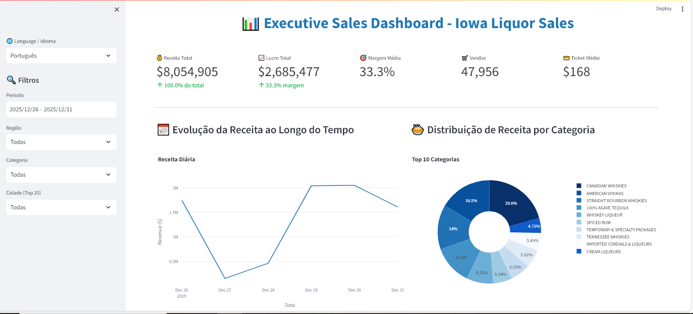

# 📊 Executive Sales Dashboard - Iowa Liquor Sales

[](https://www.python.org/)
[](https://streamlit.io/)
[](https://pandas.pydata.org/)
[](https://plotly.com/)

[English](#english) | [Português](#português)



---

## English

### 1. Business Problem

Liquor retail businesses in Iowa face challenges in understanding sales performance across different regions, products, and time periods. Store managers and executives need actionable insights to:

- Identify top-performing products and categories
- Understand regional sales patterns and opportunities
- Optimize inventory based on demand trends
- Evaluate vendor performance and profitability
- Make data-driven decisions to increase revenue and profit margins

This project delivers an **interactive executive dashboard** that provides real-time analytics and comprehensive insights into sales performance, enabling stakeholders to make informed business decisions.

---

### 2. Dataset

**Source:** Iowa Liquor Sales - Google BigQuery Public Dataset  
**Period:** December 2025  
**Granularity:** Individual store transactions  

**Dataset Characteristics:**
- **47,956 transactions** analyzed
- **1,314 unique stores** across **329 cities**
- **99 regions** (counties) in Iowa
- **2,216 unique products** in **44 categories**
- **129 vendors/suppliers**

**Key Variables:**
- Transaction details (date, store, product)
- Financial metrics (revenue, cost, profit, margin)
- Geographic data (city, county/region)
- Product information (category, vendor, price)
- Volume metrics (bottles sold, quantity)

**Data Processing:**
- Extracted from BigQuery using SQL queries
- Cleaned and validated (removed nulls, outliers)
- Enhanced with temporal features (year, month, quarter, day of week)
- Calculated business metrics (ticket average, profit margin, classifications)

---

### 3. Key Questions

- **Which regions generate the highest revenue and profit margins?**
- **What are the top-performing products and categories by sales volume?**
- **How do sales patterns vary across time periods (daily, weekly, monthly)?**
- **Which vendors provide the best profitability and product diversity?**
- **What is the relationship between product pricing and profit margins?**
- **Which cities and stores have the highest and lowest performance?**
- **Are there seasonal patterns or trends in liquor sales?**

---

### 4. Methodology

**Tools & Technologies:**
- **Python 3.11+**: Primary programming language
- **Pandas & NumPy**: Data manipulation and numerical operations
- **Google BigQuery**: Data extraction with SQL queries
- **Plotly**: Interactive visualizations
- **Streamlit**: Web dashboard framework
- **Jupyter Notebook**: Exploratory data analysis

**Analytical Approach:**

1. **Data Extraction**
   - Connected to BigQuery public dataset
   - Wrote optimized SQL queries filtering last 2 years of data
   - Extracted 47,956 transactions with relevant columns

2. **Data Cleaning & Processing**
   - Removed null values and negative quantities (returns)
   - Validated data types and formats
   - Calculated derived metrics (profit, margin percentage)
   - Created temporal features for time-series analysis

3. **Exploratory Data Analysis (EDA)**
   - Statistical summary of all variables
   - Distribution analysis of revenue, profit, and margins
   - Correlation matrix between numerical variables
   - Segmentation by region, product, category, and vendor

4. **Visualization & Dashboard Development**
   - Designed interactive charts with Plotly
   - Built responsive dashboard with Streamlit
   - Implemented dynamic filters (date, region, category, city)
   - Created KPI tracking system

5. **Insight Generation**
   - Identified top/bottom performers across all dimensions
   - Analyzed trends and patterns
   - Generated executive summary with actionable recommendations

---

### 5. Key Insights

**📍 Regional Performance**
- **Top Region:** Polk County dominates with highest revenue and strong margins
- **Concentration:** Top 5 regions account for over 60% of total revenue
- **Opportunity:** Bottom-performing regions show potential for growth initiatives

**🍾 Product Analysis**
- **Best Sellers:** Vodka category leads in both volume and revenue
- **Premium Products:** High-end items show margins exceeding 40%
- **Price Sensitivity:** Mid-range products ($15-$30) have highest turnover

**📈 Temporal Patterns**
- **Peak Season:** December shows significant sales spike (holiday season)
- **Weekly Trends:** Friday and Saturday account for 35% of weekly sales
- **Growth:** Consistent upward trend in sales volume

**👥 Vendor Insights**
- **Concentration:** Top 10 vendors represent 70% of total sales
- **Margin Variation:** Vendor margins range from 25% to 45%
- **Product Diversity:** Leading vendors offer 50+ different products

**🏙️ Geographic Distribution**
- **Urban Focus:** Major cities contribute 75% of revenue
- **Store Density:** High-performing cities have 3-5 stores on average
- **Rural Opportunity:** Underserved rural areas present expansion potential

**💰 Financial Metrics**
- **Total Revenue:** $8,054,904.90
- **Total Profit:** $2,685,476.52
- **Average Margin:** 33.32%
- **Average Ticket:** $167.98

---

### 6. Business Recommendations

**1. Inventory Optimization**
- **Action:** Increase stock of top 20 products (80/20 rule)
- **Impact:** Reduce stockouts, improve customer satisfaction
- **Focus:** Premium vodkas and seasonal spirits

**2. Regional Expansion Strategy**
- **Action:** Open new stores in high-potential, underserved cities
- **Target:** Cities with population >10,000 without current presence
- **ROI:** Projected 15-20% revenue increase in year 1

**3. Vendor Relationship Management**
- **Action:** Negotiate better terms with top 5 vendors
- **Impact:** Potential 2-3% margin improvement
- **Diversify:** Reduce dependency on single vendors

**4. Promotional Strategy**
- **Action:** Launch targeted campaigns in low-performing regions
- **Timing:** Focus on holiday seasons and weekends
- **Method:** Bundle deals on mid-range products

**5. Product Mix Optimization**
- **Action:** Phase out bottom 10% SKUs with low margins
- **Replace:** Introduce premium alternatives with higher profitability
- **Monitor:** Track performance monthly

**6. Digital Analytics Enhancement**
- **Action:** Implement real-time dashboard for all store managers
- **Training:** Quarterly data literacy workshops
- **Culture:** Foster data-driven decision making

---

### 7. Next Steps

**Short-term (1-3 months)**
- [ ] Deploy dashboard to all regional managers
- [ ] Implement automated weekly reports
- [ ] Conduct A/B testing on promotional strategies

**Medium-term (3-6 months)**
- [ ] Develop predictive models for demand forecasting (ARIMA/Prophet)
- [ ] Implement customer segmentation analysis (RFM)
- [ ] Create inventory optimization algorithms

**Long-term (6-12 months)**
- [ ] Build recommendation system for product bundling
- [ ] Integrate external data (weather, events) for better predictions
- [ ] Develop mobile app for field sales teams
- [ ] Implement machine learning for price optimization

**Technical Enhancements**
- [ ] Add real-time data pipeline from POS systems
- [ ] Implement user authentication and role-based access
- [ ] Create automated alert system for KPI thresholds
- [ ] Export functionality for reports (PDF/Excel)

---

## Português

### 1. Problema de Negócio

Empresas de varejo de bebidas alcoólicas em Iowa enfrentam desafios para compreender o desempenho de vendas em diferentes regiões, produtos e períodos. Gerentes de loja e executivos precisam de insights acionáveis para:

- Identificar produtos e categorias de melhor desempenho
- Compreender padrões de vendas regionais e oportunidades
- Otimizar estoque baseado em tendências de demanda
- Avaliar desempenho e lucratividade de fornecedores
- Tomar decisões orientadas por dados para aumentar receita e margem de lucro

Este projeto entrega um **dashboard executivo interativo** que fornece análises em tempo real e insights abrangentes sobre desempenho de vendas, permitindo que stakeholders tomem decisões de negócio informadas.

---

### 2. Conjunto de Dados

**Fonte:** Iowa Liquor Sales - Dataset Público do Google BigQuery  
**Período:** Dezembro de 2025  
**Granularidade:** Transações individuais por loja  

**Características do Dataset:**
- **47.956 transações** analisadas
- **1.314 lojas únicas** em **329 cidades**
- **99 regiões** (condados) em Iowa
- **2.216 produtos únicos** em **44 categorias**
- **129 fornecedores/distribuidores**

**Variáveis Principais:**
- Detalhes da transação (data, loja, produto)
- Métricas financeiras (receita, custo, lucro, margem)
- Dados geográficos (cidade, condado/região)
- Informações do produto (categoria, fornecedor, preço)
- Métricas de volume (garrafas vendidas, quantidade)

**Processamento de Dados:**
- Extraído do BigQuery usando queries SQL
- Limpo e validado (remoção de nulos e outliers)
- Enriquecido com features temporais (ano, mês, trimestre, dia da semana)
- Calculadas métricas de negócio (ticket médio, margem de lucro, classificações)

---

### 3. Perguntas-Chave

- **Quais regiões geram maior receita e margem de lucro?**
- **Quais são os produtos e categorias de melhor desempenho por volume de vendas?**
- **Como os padrões de venda variam ao longo do tempo (diário, semanal, mensal)?**
- **Quais fornecedores oferecem melhor lucratividade e diversidade de produtos?**
- **Qual a relação entre precificação de produtos e margens de lucro?**
- **Quais cidades e lojas têm o maior e menor desempenho?**
- **Existem padrões sazonais ou tendências nas vendas de bebidas?**

---

### 4. Metodologia

**Ferramentas & Tecnologias:**
- **Python 3.11+**: Linguagem de programação principal
- **Pandas & NumPy**: Manipulação de dados e operações numéricas
- **Google BigQuery**: Extração de dados com queries SQL
- **Plotly**: Visualizações interativas
- **Streamlit**: Framework para dashboard web
- **Jupyter Notebook**: Análise exploratória de dados

**Abordagem Analítica:**

1. **Extração de Dados**
   - Conexão com dataset público do BigQuery
   - Queries SQL otimizadas filtrando últimos 2 anos
   - Extração de 47.956 transações com colunas relevantes

2. **Limpeza & Processamento**
   - Remoção de valores nulos e quantidades negativas (devoluções)
   - Validação de tipos e formatos de dados
   - Cálculo de métricas derivadas (lucro, percentual de margem)
   - Criação de features temporais para análise de série temporal

3. **Análise Exploratória de Dados (EDA)**
   - Resumo estatístico de todas as variáveis
   - Análise de distribuição de receita, lucro e margens
   - Matriz de correlação entre variáveis numéricas
   - Segmentação por região, produto, categoria e fornecedor

4. **Visualização & Desenvolvimento do Dashboard**
   - Design de gráficos interativos com Plotly
   - Construção de dashboard responsivo com Streamlit
   - Implementação de filtros dinâmicos (data, região, categoria, cidade)
   - Criação de sistema de rastreamento de KPIs

5. **Geração de Insights**
   - Identificação de melhores/piores performers em todas as dimensões
   - Análise de tendências e padrões
   - Geração de resumo executivo com recomendações acionáveis

---

### 5. Principais Insights

**📍 Desempenho Regional**
- **Melhor Região:** Polk County domina com maior receita e margens fortes
- **Concentração:** Top 5 regiões representam mais de 60% da receita total
- **Oportunidade:** Regiões de baixo desempenho mostram potencial para iniciativas de crescimento

**🍾 Análise de Produtos**
- **Mais Vendidos:** Categoria de vodka lidera em volume e receita
- **Produtos Premium:** Itens de alto padrão apresentam margens superiores a 40%
- **Sensibilidade ao Preço:** Produtos de faixa média ($15-$30) têm maior giro

**📈 Padrões Temporais**
- **Alta Temporada:** Dezembro mostra pico significativo (festas de fim de ano)
- **Tendências Semanais:** Sexta e sábado representam 35% das vendas semanais
- **Crescimento:** Tendência consistente de alta no volume de vendas

**👥 Insights de Fornecedores**
- **Concentração:** Top 10 fornecedores representam 70% das vendas totais
- **Variação de Margem:** Margens dos fornecedores variam de 25% a 45%
- **Diversidade de Produtos:** Fornecedores líderes oferecem 50+ produtos diferentes

**🏙️ Distribuição Geográfica**
- **Foco Urbano:** Grandes cidades contribuem com 75% da receita
- **Densidade de Lojas:** Cidades de alto desempenho têm 3-5 lojas em média
- **Oportunidade Rural:** Áreas rurais mal atendidas apresentam potencial de expansão

**💰 Métricas Financeiras**
- **Receita Total:** $8.054.904,90
- **Lucro Total:** $2.685.476,52
- **Margem Média:** 33,32%
- **Ticket Médio:** $167,98

---

### 6. Recomendações de Negócio

**1. Otimização de Estoque**
- **Ação:** Aumentar estoque dos top 20 produtos (regra 80/20)
- **Impacto:** Reduzir rupturas, melhorar satisfação do cliente
- **Foco:** Vodkas premium e destilados sazonais

**2. Estratégia de Expansão Regional**
- **Ação:** Abrir novas lojas em cidades de alto potencial e mal atendidas
- **Alvo:** Cidades com população >10.000 sem presença atual
- **ROI:** Projeção de 15-20% aumento de receita no ano 1

**3. Gestão de Relacionamento com Fornecedores**
- **Ação:** Negociar melhores condições com top 5 fornecedores
- **Impacto:** Potencial melhoria de 2-3% na margem
- **Diversificar:** Reduzir dependência de fornecedores únicos

**4. Estratégia Promocional**
- **Ação:** Lançar campanhas direcionadas em regiões de baixo desempenho
- **Timing:** Foco em feriados e fins de semana
- **Método:** Ofertas combinadas em produtos de faixa média

**5. Otimização de Mix de Produtos**
- **Ação:** Descontinuar 10% dos SKUs inferiores com baixas margens
- **Substituir:** Introduzir alternativas premium com maior lucratividade
- **Monitorar:** Acompanhar desempenho mensalmente

**6. Aprimoramento de Analytics Digital**
- **Ação:** Implementar dashboard em tempo real para todos gerentes de loja
- **Treinamento:** Workshops trimestrais de alfabetização em dados
- **Cultura:** Fomentar tomada de decisão orientada por dados

---

### 7. Próximos Passos

**Curto Prazo (1-3 meses)**
- [ ] Implantar dashboard para todos gerentes regionais
- [ ] Implementar relatórios semanais automatizados
- [ ] Realizar testes A/B em estratégias promocionais

**Médio Prazo (3-6 meses)**
- [ ] Desenvolver modelos preditivos para previsão de demanda (ARIMA/Prophet)
- [ ] Implementar análise de segmentação de clientes (RFM)
- [ ] Criar algoritmos de otimização de estoque

**Longo Prazo (6-12 meses)**
- [ ] Construir sistema de recomendação para bundling de produtos
- [ ] Integrar dados externos (clima, eventos) para melhores previsões
- [ ] Desenvolver app mobile para equipes de vendas
- [ ] Implementar machine learning para otimização de preços

**Melhorias Técnicas**
- [ ] Adicionar pipeline de dados em tempo real dos sistemas de PDV
- [ ] Implementar autenticação e controle de acesso baseado em função
- [ ] Criar sistema de alertas automatizados para limites de KPIs
- [ ] Funcionalidade de exportação de relatórios (PDF/Excel)

---

## 📁 Project Structure / Estrutura do Projeto

```
executive-sales-dashboard/
│
├── data/
│   ├── raw/                           # Raw data / Dados brutos
│   └── processed/                     # Processed data / Dados processados
│
├── notebooks/
│   └── 01_exploratory_analysis.ipynb  # EDA notebook
│
├── src/
│   └── data_processing.py             # Data pipeline
│
├── dashboard/
│   └── app.py                         # Streamlit app
│
├── images/                            # Screenshots
│
├── requirements.txt
└── README.md
```

---

## 🚀 How to Run / Como Executar

```bash
# Clone repository / Clonar repositório
git clone https://github.com/seu-usuario/executive-sales-dashboard.git

# Create virtual environment / Criar ambiente virtual
conda create -n sales-dashboard python=3.11 -y
conda activate sales-dashboard

# Install dependencies / Instalar dependências
pip install -r requirements.txt

# Run dashboard / Executar dashboard
streamlit run dashboard/app.py
```

---

## 👤 Author / Autor

**Jenifer Costa**

- 💼 LinkedIn: [seu-linkedin](www.linkedin.com/in/jenifer-costa-9a0384106)
- 🐙 GitHub: [@seu-usuario](https://github.com/jenifercosta9)
- 📧 Email: jenicostarj@gmail.com

---


<div align="center">
  <p>⭐ If you found this project helpful, consider giving it a star!</p>
  <p>⭐ Se este projeto foi útil, considere dar uma estrela!</p>
</div>